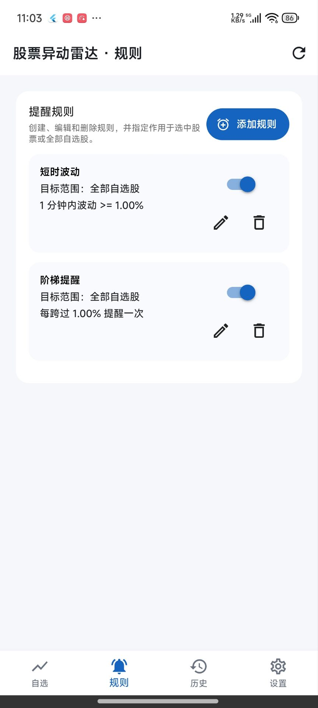
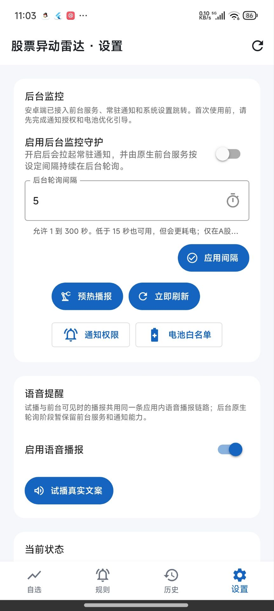

# 股票异动雷达

面向 A 股市场的 Android 股票异动监控应用，聚焦“自选股管理 → 行情刷新 → 异动提醒 → 中文语音播报”这条核心链路。

## 核心能力

- 自选股搜索、添加、删除与行情刷新
- 短时波动提醒与台阶提醒
- 中文语音播报与提醒预览
- 提醒历史记录查看
- Android 后台监控与轮询设置
- 面向真机容错的行情刷新策略

## 当前状态

当前仓库提供的是一个可运行、可继续迭代的 Android 原型版本，重点覆盖：

- 自选股与规则管理
- 行情刷新与提醒触发
- 提醒历史与设置页
- 中文语音播报链路

## 页面截图

当前仓库展示 4 个主要页面的真实截图：自选、规则、历史、设置。

| 自选 | 规则 |
|---|---|
|  |  |

| 历史 | 设置 |
|---|---|
|  |  |

## 提醒规则

- **短时大幅波动**：在指定分钟窗口内监测涨跌幅变化
- **台阶提醒**：按价格或涨跌幅台阶触发提醒

## 数据来源

- 搜索：东方财富 `suggest` 接口
- 行情：东方财富 `push2` 行情接口
- 当前版本已补充多源容错思路，用于降低单一行情源异常时的整页失败概率

> 本项目使用公开数据接口，仅用于学习、研究与产品原型验证。

## 项目结构

```text
lib/
  app/
  core/
  data/
  features/
  services/
android/
docs/
test/
```

## 环境要求

- Flutter 3.x
- Dart SDK
- Android SDK

## 开发

```bash
flutter pub get
flutter run
```

## 测试

```bash
flutter analyze
flutter test
```

## 构建

```bash
flutter build apk --release
```

## 已知限制

- 当前版本主要面向 Android
- 搜索和行情能力依赖第三方公开接口
- 第三方接口限流、变更或不可用时会影响搜索和行情刷新
- 截图资源仍在逐步补齐，当前以“真实截图 + 明确占位图”混合呈现

## AI 开发说明

本项目在研发过程中引入了 AI 辅助工具，主要用于原型搭建、测试补充、部分重构与缺陷修复，以及少量文档整理。

需求定义、方案取舍、关键改动确认与最终验收仍由人工负责。仓库中的部分代码或测试由 AI 辅助生成或修改，最终以实际运行结果、测试结果和人工复核结论为准。

> 本仓库采用“AI 辅助开发 + 人工审核把关”的协作方式，并非完全由人工逐行编写。
