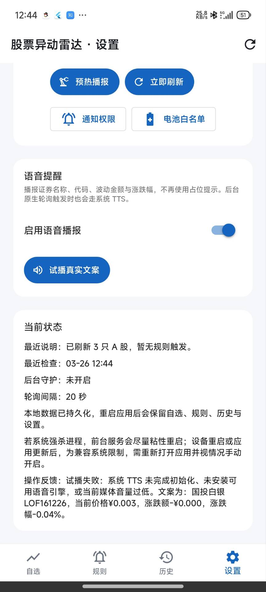
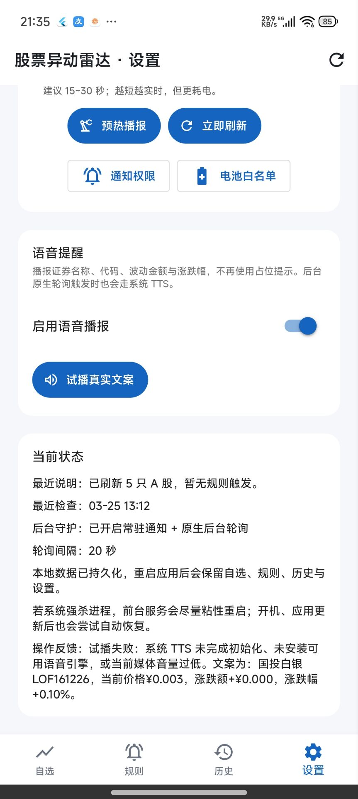

# Stock Alert App

面向 A 股场景的 Android 股票异动监控应用，聚焦“添加自选 → 配置规则 → 后台盯盘 → 中文语音提醒”这条高频使用链路。

## Features

- 自选股管理
- 按代码 / 名称 / 拼音缩写模糊搜索
- 实时行情刷新
- 短时大幅波动提醒
- 价格台阶 / 涨跌幅台阶提醒
- 中文语音播报
- 提醒历史记录
- 面向中文用户的本地化界面
- Android 后台常驻监控

## Screenshots

| 状态页 | 设置页 |
|---|---|
|  |  |

## Alert Rules

当前支持两类提醒规则：

- **短时大幅波动**：在 N 分钟窗口内涨跌超过 X%
- **台阶提醒**：价格或涨跌幅每跨过一个固定台阶提醒一次

提醒历史会记录规则类型、触发行情、播报文案和播报结果，方便复盘。

## Data Sources

- 搜索：东方财富 suggest 接口
- 行情：东方财富 push2 个股行情接口

> 本项目使用公开数据接口，仅用于学习、研究与产品原型验证。

## Project Structure

```text
lib/
  app/
  core/
  data/
    models/
    repositories/
  features/
    alerts/
    history/
    settings/
    watchlist/
  services/
    alerts/
    audio/
    background/
    market/
android/
test/
docs/
```

## Getting Started

### Requirements

- Flutter 3.x
- Dart SDK（与当前 Flutter 版本匹配）
- Android SDK

### Run

```bash
flutter pub get
flutter run
```

### Test

```bash
flutter analyze
flutter test
```

### Build

```bash
flutter build apk --release
```

## Current Status

当前仓库主要面向 Android 端验证与迭代，已经具备：

- 自选股搜索与添加
- 后台监控与状态展示
- 中文语音试播 / 播报
- 提醒规则管理与历史记录

正式发布签名、分发流程和更完整的发布工程化仍可继续完善。

## Known Limitations

- 当前版本主要面向 Android
- 数据可用性依赖第三方公开接口
- 第三方接口的限流、变更或不可用会影响搜索和行情刷新
- 正式生产发布流程仍有继续完善空间

## AI-First Development

This project was built in an AI-first workflow. Product requirements, implementation, refactoring, debugging, test generation, and documentation were completed through AI-assisted development. Human input focused on defining goals, validating results, and deciding what to keep.

All production code in this repository was generated and iterated through AI tooling rather than written manually line by line.

## Local Notes

Machine-specific setup, local environment details, and non-portable development notes are intentionally kept out of this README and should be documented in local-only files that are not committed to Git.
